# Modern AI Systems Architecture: LLMs, MCP, and Agentic AI

> A precise, vendor-neutral, implementation-focused reference for senior engineers, AI architects, and platform teams.

---

## Table of Contents

1. [Foundational Layer Model](#0-foundational-layer-model)
2. [Modern LLM Architecture](#1-modern-llm-architecture)
3. [MCP (Model Context Protocol) Architecture](#2-mcp-model-context-protocol-architecture)
4. [Agentic AI Architecture](#3-agentic-ai-architecture)
5. [End-to-End Enterprise Interaction](#4-end-to-end-enterprise-interaction)
6. [Comparison Table](#5-comparison-table)
7. [When to Use Each Pattern](#6-when-to-use-each-pattern)
8. [Best Practices and Anti-Patterns](#7-best-practices-and-anti-patterns)

---

## 0. Foundational Layer Model

Every production AI system can be decomposed into seven canonical layers. Subsequent sections map each architecture onto this model.

| Layer | Responsibility | Representative Concerns |
|---|---|---|
| **Foundation Model Layer** | Pre-trained weights, tokenizer, model architecture | Transformer blocks, attention, parameter count, context window |
| **Runtime / Inference Layer** | Serving, batching, KV-cache, decoding | Throughput, TTFT, TPOT, tensor parallelism, speculative decoding |
| **Context Management Layer** | Prompt assembly, window budgeting, compression | System prompt, history, RAG snippets, tool schemas |
| **Tool Integration Layer** | Function/tool calling, MCP, API adapters | JSON schema, capability discovery, sandboxing |
| **Agent Orchestration Layer** | Planning, routing, multi-agent control | ReAct, plan-execute, supervisor/worker, graph state |
| **Memory & Retrieval Layer** | Short-term, long-term, semantic memory | Embeddings, vector DB, hybrid search, rerankers |
| **Planning & Reasoning Layer** | Decomposition, reflection, evaluation | Chain-of-thought, tree-of-thought, critic models |

Cross-cutting: **Observability**, **Guardrails/Policy**, **Identity & AuthZ**, **Cost/Quota Governance**.

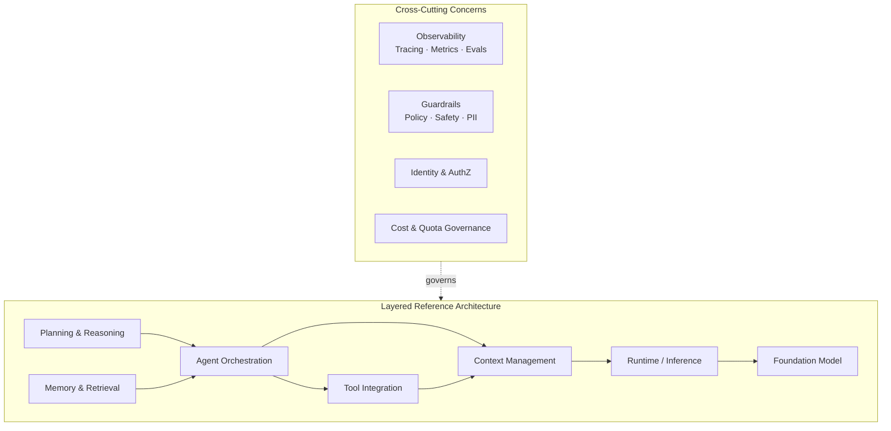

---

## 1. Modern LLM Architecture

### 1.1 High-Level Overview

A modern LLM application stack exposes a foundation model through an inference runtime, fronted by a context-assembly pipeline and policy/observability sidecars. The model itself is a decoder-only **Transformer** trained for next-token prediction, then post-trained via SFT and preference optimization (RLHF / DPO / GRPO) for instruction following and tool use.

### 1.2 Core Components

**Foundation model layer**
- **Tokenizer** — BPE / SentencePiece / Tiktoken; deterministic text↔token mapping.
- **Embedding matrix** — Maps token ids to dense vectors `d_model`.
- **Transformer stack** — N decoder blocks, each containing:
  - **Multi-Head Self-Attention** (often **Grouped-Query** or **Multi-Query Attention** for inference efficiency).
  - **Rotary Position Embeddings (RoPE)** or ALiBi for positional information.
  - **RMSNorm** pre-normalization.
  - **SwiGLU** feed-forward / **Mixture-of-Experts (MoE)** routed FFN.
- **LM head** — Tied or untied projection back to vocabulary; softmax → token probabilities.

**Inference runtime**
- **KV cache** — Per-layer cache of attention keys/values for previously decoded tokens; turns generation from O(n²) into O(n) per step.
- **PagedAttention / vLLM-style block manager** — KV cache as fixed-size pages enabling high concurrency.
- **Continuous batching** — Token-level scheduler interleaves prefill and decode across requests.
- **Speculative / assisted decoding** — Draft model proposes tokens; target model verifies in parallel.
- **Quantization** — INT8 / FP8 / INT4 (AWQ, GPTQ) weight + activation quantization for memory/latency.
- **Parallelism** — Tensor parallel, pipeline parallel, expert parallel, sequence parallel.

**Context management**
- System prompt, instructions, few-shot exemplars, tool schemas, retrieved snippets, prior turns, user query — composed under a token budget by a **prompt compiler**.

**Sampling controls**
- Temperature, top-p, top-k, repetition penalty, JSON / regex / grammar-constrained decoding (e.g. Outlines, XGrammar).

### 1.3 Transformer Block (Component Diagram)

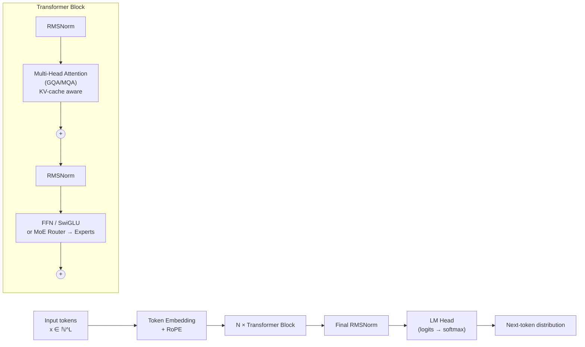

### 1.4 Request Lifecycle

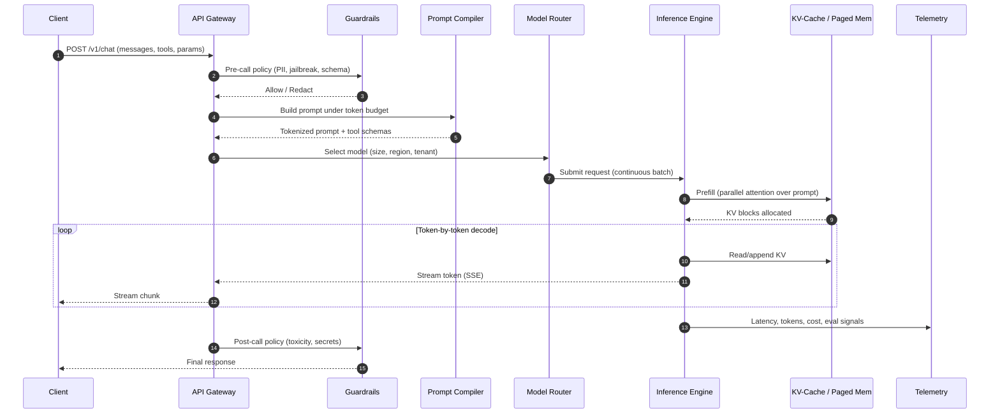

### 1.5 Data Flow

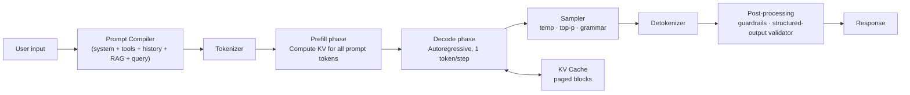

### 1.6 Deployment & Runtime Considerations

- **Serving stacks**: vLLM, TensorRT-LLM, SGLang, TGI, llama.cpp, MLC-LLM.
- **Hardware**: NVIDIA H100/H200/B200, AMD MI300X, AWS Trainium/Inferentia, Google TPU v5p.
- **Topology**: TP within node, PP / EP across nodes, NCCL/RCCL for collectives.
- **SLOs**: TTFT (time-to-first-token), TPOT (time-per-output-token), p95/p99 latency, tokens/sec/GPU.
- **Caching**: Prefix / prompt caching for shared system prompts; semantic response caching at the gateway.
- **Routing**: Cascaded routing (small → large) and quality-based routing (e.g. RouteLLM).

### 1.7 Scalability Concerns

- KV-cache memory is the dominant footprint at long context — mitigate via GQA, paging, quantized KV (FP8/INT8), sliding-window or attention sinks.
- **Context length** scales attention compute and memory; FlashAttention-2/3 and ring attention reduce HBM pressure.
- **Throughput vs latency**: continuous batching maximizes throughput but tail-latency requires admission control and priority queues.
- **Cold starts**: weight loading dominates — keep warm replicas per region/tenant.

### 1.8 Security Considerations

- **Prompt injection** (direct and indirect via retrieved/tool content) — treat all model-visible text as untrusted.
- **Data exfiltration** through tool calls or markdown image URLs.
- **Model/weight protection**: encrypted storage, attested loaders, signed model cards.
- **Tenant isolation**: per-tenant KV namespaces, no cross-request cache leakage.
- **Output safety**: classifiers for toxicity / CSAM / self-harm; PII redaction; secret scanning on responses.

### 1.9 Typical Tech Stack

| Concern | Examples |
|---|---|
| Serving | vLLM, TensorRT-LLM, SGLang, Triton |
| Orchestration | Kubernetes, KServe, Ray Serve |
| Gateway | Envoy, LiteLLM, Portkey, Kong AI Gateway |
| Observability | OpenTelemetry, Langfuse, Arize, Helicone |
| Eval | OpenAI Evals, Inspect, Promptfoo, Ragas |

---

## 2. MCP (Model Context Protocol) Architecture

### 2.1 High-Level Overview

**MCP** is an open, JSON-RPC 2.0–based protocol that standardizes how LLM applications discover and invoke external **tools**, **resources**, and **prompts** exposed by independent **servers**. It plays the same role for AI applications that **LSP** plays for editors: one client, many interoperable servers.

Key abstractions:
- **Host** — The user-facing AI application (IDE, chatbot, agent runtime).
- **Client** — An MCP client *instance* inside the host, maintaining a 1:1 stateful session with a server.
- **Server** — A process exposing capabilities: tools (model-callable functions), resources (readable context like files/DB rows), and prompts (parameterized templates).
- **Transport** — `stdio` for local subprocesses; **Streamable HTTP** (with optional SSE) for remote servers.

### 2.2 Core Components

**Protocol primitives**
- `initialize` → capability negotiation, protocol version handshake.
- `tools/list`, `tools/call` — discovery and invocation of tools (JSON-Schema typed args).
- `resources/list`, `resources/read`, `resources/subscribe` — addressable, optionally subscribable context.
- `prompts/list`, `prompts/get` — server-supplied prompt templates with arguments.
- `sampling/createMessage` — *server → client* reverse call to ask the host's LLM to complete text.
- `roots/list`, `elicitation/create` — workspace boundaries and structured user prompts.
- `notifications/*` — push updates for tool/resource list changes and progress.

**Server capabilities**
- Tools (side-effecting actions), Resources (read-only context), Prompts (templates), Logging, Completions, Sampling, Roots, Elicitation.

**Security model**
- **OAuth 2.1** with PKCE for remote HTTP servers; bearer tokens never forwarded blindly.
- **Consent & scoping** at the host level: per-tool, per-resource user approval.
- **Sandboxing** of stdio servers; egress controls for HTTP servers.

### 2.3 Component Diagram

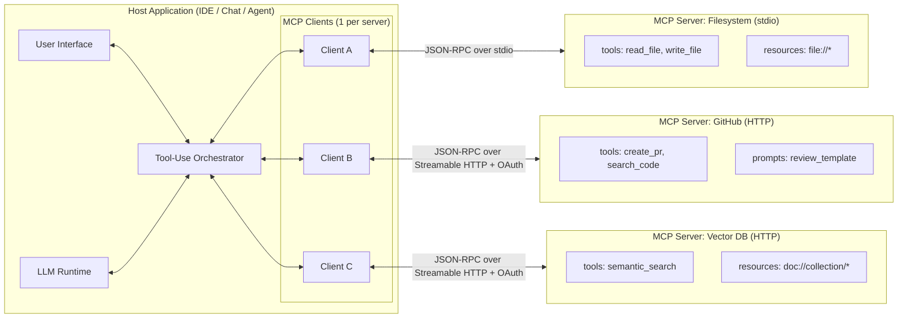

### 2.4 Session & Request Lifecycle

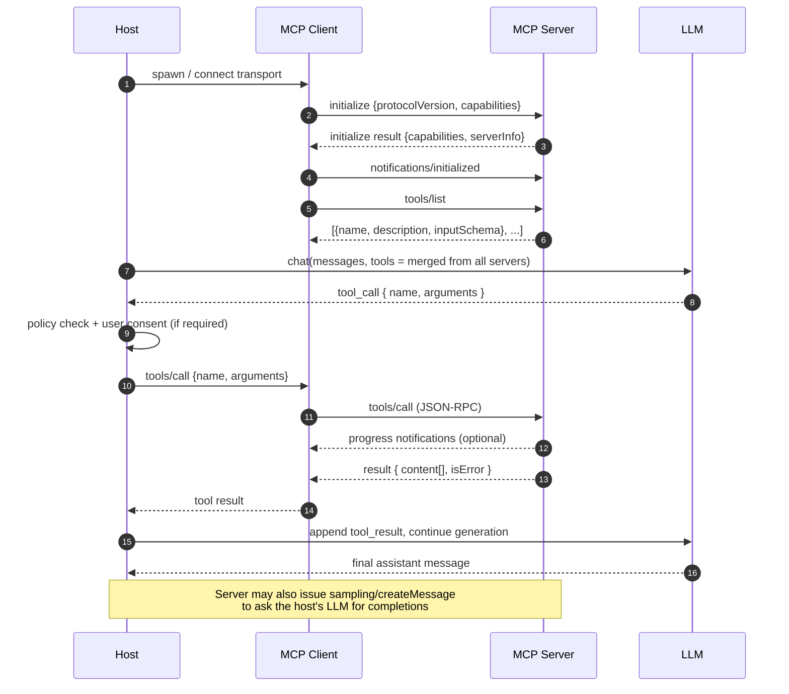

### 2.5 Data Flow

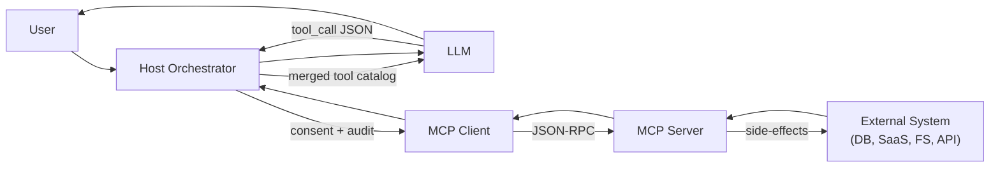

### 2.6 Deployment & Runtime Considerations

- **Local stdio servers**: simplest model — host spawns server as a child process; ideal for filesystem, git, local DB access.
- **Remote HTTP servers**: deploy as stateless services behind an API gateway with OAuth; horizontal-scale per server.
- **Server registry / catalog**: enterprises maintain an internal registry of approved MCP servers with version pinning and SBOMs.
- **Capability negotiation**: clients must gracefully degrade when a server lacks `sampling`, `roots`, or `elicitation`.

### 2.7 Scalability Concerns

- **Tool schema bloat**: hundreds of tools blow the context window — group servers by task, use dynamic enable/disable, or a *tool router* (retrieve top-k relevant tools by embedding).
- **Latency**: remote HTTP servers add a network hop per call — batch where possible, stream progress, cache idempotent reads.
- **Connection sprawl**: one client-server session per server; multiplex with HTTP/2 + Streamable HTTP.

### 2.8 Security Considerations

- **Confused-deputy / tool-poisoning attacks**: malicious server descriptions can override system instructions — pin server versions, hash-verify descriptions, sandbox descriptions away from the system prompt.
- **Indirect prompt injection** from resource content: treat all `resources/read` payloads as untrusted.
- **OAuth scope minimization**: prefer fine-grained scopes per tool; rotate tokens; never store long-lived refresh tokens in the model context.
- **Consent UX**: explicit user approval for destructive tools, with diff previews.
- **Auditing**: structured logs of every `tools/call` with arguments, caller identity, and result hash.

### 2.9 Typical Tech Stack

| Concern | Examples |
|---|---|
| SDKs | `@modelcontextprotocol/sdk` (TS/Py/Go/Rust/C#/Java) |
| Hosts | Claude Desktop/Code, Cursor, VS Code, Zed, custom agents |
| Transports | stdio, Streamable HTTP, SSE (deprecated, transitioning) |
| Auth | OAuth 2.1 + PKCE, dynamic client registration (RFC 7591) |
| Registries | Internal catalogs, public MCP registries |

---

## 3. Agentic AI Architecture

### 3.1 High-Level Overview

An **agent** is an LLM-driven control loop that **perceives** (reads inputs and memory), **plans** (decomposes goals), **acts** (invokes tools), and **reflects** (evaluates outcomes), iterating until a termination condition is met. Agentic systems extend this with **multi-agent orchestration**, **durable workflow state**, **event-driven triggers**, and **human-in-the-loop** checkpoints.

### 3.2 Core Components

**Orchestration layer**
- **Agent runtime / graph executor** — Stateful FSM or DAG; e.g. LangGraph, AutoGen, CrewAI, Semantic Kernel, OpenAI Agents SDK.
- **Topologies**: single-agent ReAct, supervisor/worker, hierarchical, network/swarm, blackboard.

**Planning & reasoning**
- **ReAct** (Reason+Act interleaved), **Plan-and-Execute**, **Tree-of-Thoughts**, **Reflexion**, **Self-Consistency**.
- **Critic / verifier models** to score intermediate steps.
- **Constrained generation** for structured plans (JSON / DSL).

**Memory systems**
- **Working memory** — Current conversation / scratchpad (in-context).
- **Episodic memory** — Past interaction traces, summarized and indexed.
- **Semantic memory** — Stable knowledge in vector + keyword stores (RAG).
- **Procedural memory** — Learned skills / cached tool sequences / saved prompts.
- **Entity memory** — Per-user/per-org structured facts.

**Retrieval pipeline (RAG)**
- Ingestion: parse → chunk (semantic / recursive) → embed → index.
- Query: query rewrite/expansion → hybrid retrieval (BM25 + dense) → rerank (cross-encoder) → context packing.
- Advanced: **HyDE**, **GraphRAG**, **CRAG** (corrective), **Self-RAG**, **multi-hop** retrieval.

**Tool integration**
- Native function calling, **MCP** servers, OpenAPI adapters, code-interpreter sandboxes (Firecracker / gVisor / WASM).

**Workflow state management**
- Durable checkpoints (Postgres, Redis), idempotency keys, replay, compensating actions.
- Engines: Temporal, Restate, Inngest, AWS Step Functions, LangGraph checkpointers.

**Event-driven triggers**
- Kafka / SQS / webhooks → agent invocations; long-running agents with pause/resume on external events.

**Human-in-the-loop (HITL)**
- Approval gates before destructive tool calls.
- Interrupt-and-edit flows (modify proposed actions).
- Confidence-based escalation to humans.

**Guardrails & policy**
- Input filters (jailbreak, PII), output filters (toxicity, secrets), tool-call validators (allow-list, rate limit), structural validators (JSON Schema).
- Frameworks: NeMo Guardrails, Guardrails AI, Llama Guard, Azure AI Content Safety.

**Observability**
- Structured traces (OpenTelemetry GenAI semantic conventions), per-step token/cost accounting, replayable runs, online + offline evals.

### 3.3 Single-Agent Component Diagram

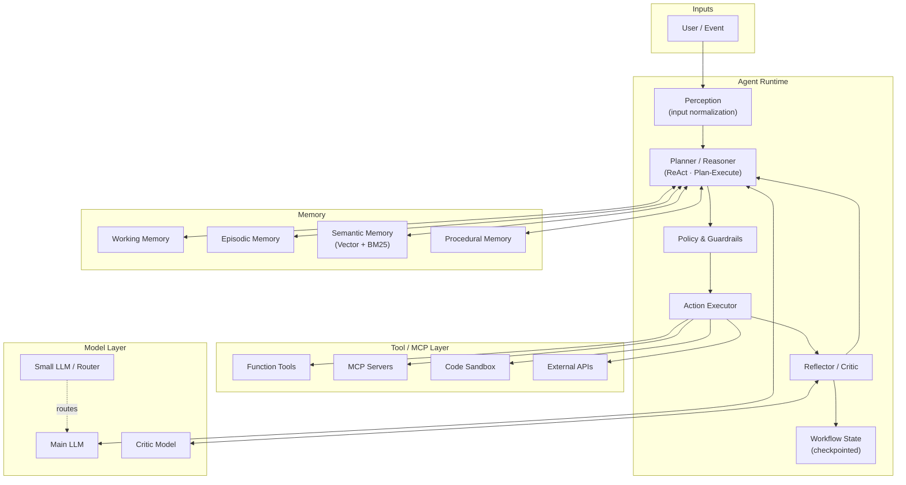

### 3.4 Agent Control Loop (Sequence)

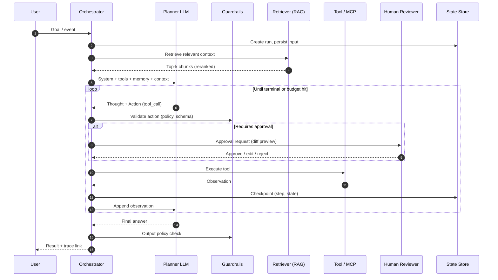

### 3.5 Multi-Agent Orchestration (Supervisor / Worker)

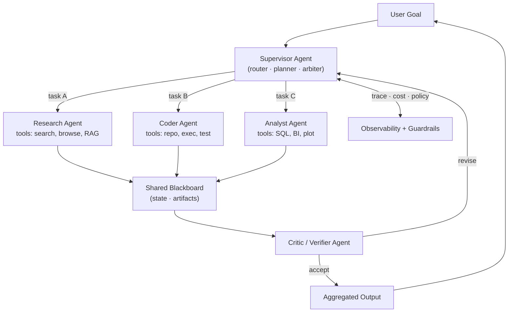

### 3.6 RAG Pipeline (Flow)

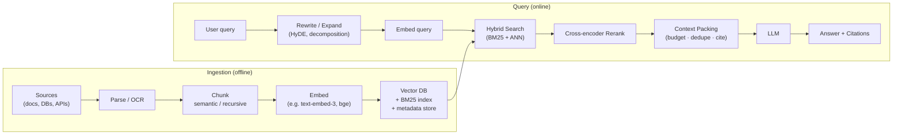

### 3.7 Event-Driven Agent Workflow

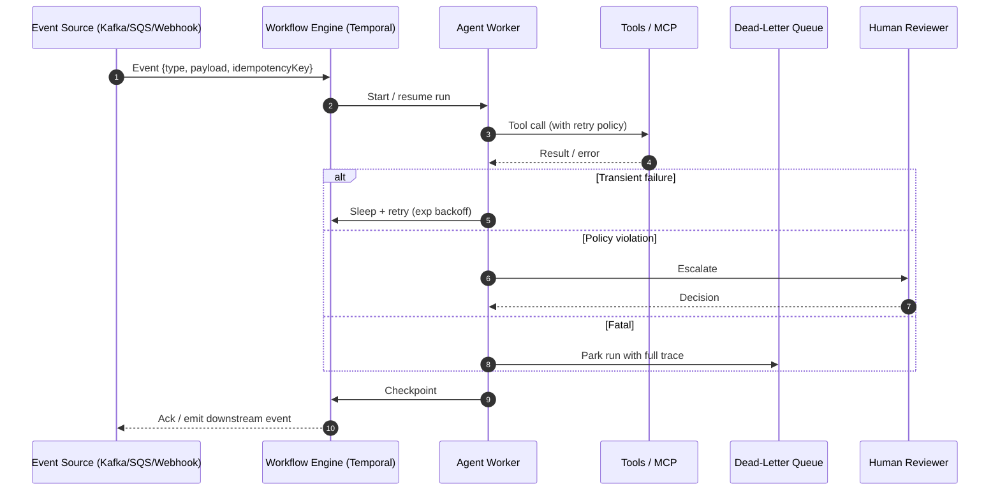

### 3.8 Deployment & Runtime Considerations

- **Stateless agent workers** behind a durable workflow engine — agents become idempotent step handlers.
- **Per-tenant isolation**: separate memory namespaces, vector indices, and tool credentials.
- **Cost controls**: per-run token/$ budgets, step caps, recursion limits, tool-call quotas.
- **Eval-in-CI**: regression suites with golden traces; canary deploys gated on eval metrics.
- **Offline + online evals**: LLM-as-judge with calibration, human review sampling.

### 3.9 Scalability Concerns

- **Context window blow-up** from long traces — periodic summarization, scratchpad pruning, hierarchical memory.
- **Tool/agent fan-out** — bound parallelism, use semaphores on shared resources.
- **Hot vector indices** — shard by tenant/topic; tiered storage (hot SSD ANN, cold object-store).
- **Determinism** — seed sampling, temperature 0 for critical steps, record-and-replay traces.

### 3.10 Security Considerations

- **Prompt injection** is the #1 risk — segregate untrusted content with strict markers, never let retrieved text override system instructions, prefer structured tool outputs.
- **Least-privilege tools** — per-agent credentials, scoped tokens, allow-listed domains, signed tool manifests.
- **Sandboxed execution** — Firecracker/gVisor/WASM for code-interpreter agents; egress firewalls.
- **Data governance** — DLP on inputs and outputs; per-region data residency; right-to-be-forgotten on memory.
- **Supply-chain** — pin agent prompts, tool versions, MCP server hashes; SBOM for plugins.

### 3.11 Typical Tech Stack

| Concern | Examples |
|---|---|
| Agent frameworks | LangGraph, OpenAI Agents SDK, AutoGen, CrewAI, Semantic Kernel, Pydantic-AI |
| Workflow durability | Temporal, Restate, Inngest, AWS Step Functions |
| Vector DB | pgvector, Qdrant, Weaviate, Pinecone, Milvus, Vespa |
| Rerankers | Cohere Rerank, bge-reranker, Voyage Rerank |
| Guardrails | NeMo Guardrails, Guardrails AI, Llama Guard, Azure Content Safety |
| Sandboxing | Firecracker, gVisor, E2B, Modal, WASM (Wasmtime) |
| Observability | OpenTelemetry (GenAI conv.), Langfuse, Arize Phoenix, Helicone, Datadog LLM Obs |
| Evals | Ragas, DeepEval, Promptfoo, Inspect, OpenAI Evals |

---

## 4. End-to-End Enterprise Interaction

A production enterprise system composes all three architectures: the **LLM** provides reasoning, **MCP** provides standardized tool access, **agentic orchestration** provides goal-directed control, and **RAG + memory** provide grounded context.

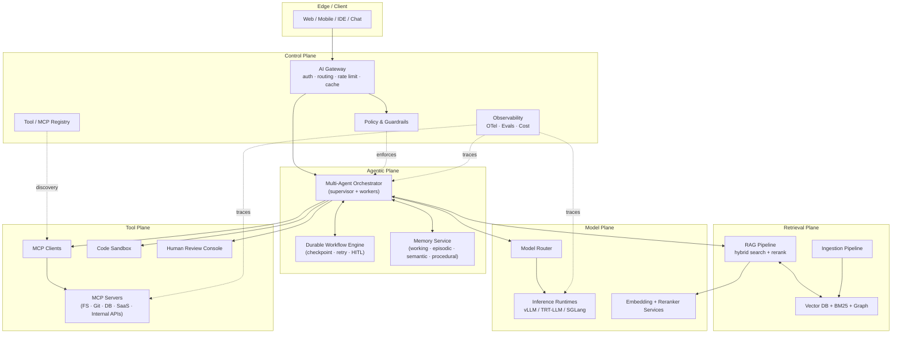

**End-to-end request walk-through** (e.g. *"Reconcile last month's invoices and email a summary to finance"*):

1. **Edge** — Chat client streams request to the AI Gateway with OIDC token.
2. **Gateway** — AuthN/Z, rate limit, tenant routing, prompt-injection prescan.
3. **Orchestrator** — Supervisor agent plans: `retrieve_policy → query_finance_db → fetch_invoices_mcp → reconcile → draft_email → human_approve → send_email`.
4. **Memory + RAG** — Pulls reconciliation SOP from semantic memory; user prefs from entity memory.
5. **Model plane** — Router picks a large model for planning, a small model for extraction.
6. **MCP layer** — Worker agents call `finance-db`, `sap`, `gmail` MCP servers; results are typed JSON.
7. **Workflow engine** — Each step checkpointed; failed steps retry with backoff; HITL gate on `send_email`.
8. **Guardrails** — Output scanned for PII; email recipients allow-listed.
9. **Observability** — Full OTel trace, per-step tokens/cost, eval scores, replay link.

---

## 5. Comparison Table

| Dimension | Traditional LLM App | RAG System | MCP-Based System | Agentic AI System |
|---|---|---|---|---|
| **Primary goal** | Single-turn / chat completion | Grounded Q&A over private data | Standardized tool/resource access | Autonomous, multi-step goal completion |
| **Control flow** | Stateless request/response | Retrieve → generate | Tool catalog + invoke | Iterative loop: plan → act → reflect |
| **State** | None (or short history) | Per-query | Per-session (MCP) | Durable workflow state |
| **Tools** | None / inline | Retriever only | Many, via standard protocol | Many + planner-selected |
| **Memory** | Conversation buffer | Vector index | Server-provided resources | Multi-tier (working/episodic/semantic/procedural) |
| **Reasoning** | One-shot generation | One-shot grounded | One-shot tool use | Multi-step + reflection + critic |
| **Failure mode** | Hallucination | Stale / wrong retrieval | Tool misuse, injection | Loops, runaway cost, cascading errors |
| **Latency** | Low (single inference) | Low–Med (1 retrieval + 1 inference) | Med (per-tool RT) | High (multi-step) |
| **Cost profile** | Predictable | Predictable | Variable | Highly variable |
| **Observability needs** | Basic logs | + retrieval metrics | + tool-call audit | Full trace, evals, replay |
| **Best for** | Q&A, summarization, classification | Enterprise search, doc QA | IDE/agent tooling, ecosystem interop | Workflows, automation, copilots |
| **Anti-pattern** | Using for tasks needing fresh data | Using when no proprietary corpus | Exposing privileged tools without consent | Using for deterministic single-step jobs |

---

## 6. When to Use Each Pattern

- **Plain LLM call** — Pure language transformation: classification, rewriting, summarization of provided text, code translation. No external state, no fresh data needed.
- **RAG** — Answers must be grounded in a private/large corpus that doesn't fit in context, with citations and freshness control. Choose when the task is *predominantly retrieval + synthesis*.
- **MCP-based system** — You need a portable, governed integration surface between AI applications and many tools/resources, especially across teams or vendors. Use MCP whenever tool integration would otherwise become bespoke per host.
- **Agentic AI** — The task requires *multi-step reasoning*, conditional branching, tool use, or long-running execution with checkpoints and human approvals. Justified when value per run > cost of orchestration complexity.

**Composition rule of thumb**: start with the simplest pattern that works. Add RAG when grounding is needed, MCP when tool surface grows, agents only when control flow truly requires iteration. Avoid agents-by-default — they amplify both capability and failure.

---

## 7. Best Practices and Anti-Patterns

### 7.1 Best Practices

**Architecture**
- Treat the LLM as an untrusted component; validate every output with schemas/classifiers.
- Separate **planning** (large model) from **execution** (small/cheap models) — cascaded routing.
- Make all agent steps **idempotent** and **checkpointable**; design for replay.
- Keep the system prompt small and stable; push variability to retrieved context and tool schemas (improves prompt caching).
- Version everything: prompts, tools, MCP server hashes, model snapshots.

**Context & retrieval**
- Hybrid retrieval (BM25 + dense) + cross-encoder rerank beats dense-only in nearly all enterprise corpora.
- Chunk semantically with overlap; store rich metadata (source, ACL, timestamp); enforce ACLs at retrieval time, not just at presentation.
- Cite sources in outputs; verify citations with a post-hoc check.

**Tools & MCP**
- Prefer few, well-described tools over many overlapping ones. Auto-generate descriptions from OpenAPI then human-curate.
- Require user consent for destructive tools; show diffs before execution.
- Pin and hash MCP server descriptions; treat them as code, not config.

**Agents**
- Bound recursion depth, tool calls, wall-clock, and token budget per run.
- Use a **critic/verifier** step before committing irreversible actions.
- Add HITL gates on high-risk steps; design the human UX to allow *edit*, not just approve/reject.

**Safety & security**
- Defense in depth: input filter → context segregation → constrained generation → output filter → tool allow-list.
- Sandbox code execution; egress allow-lists; per-tool credentials with least privilege.
- Red-team continuously (injection corpora, jailbreaks, tool-poisoning).

**Observability & evals**
- Emit OpenTelemetry GenAI spans for every model and tool call.
- Maintain a **golden eval set** per use case; gate deploys on eval deltas.
- Sample production traces for human review; close the loop into eval data.

### 7.2 Anti-Patterns

- **"Agentify everything"** — wrapping single-step tasks in agent loops adds latency, cost, and failure modes.
- **Mega-prompts** — stuffing all instructions, tools, and history into one prompt; instead structure with caching boundaries.
- **Unbounded loops** — no step cap, no budget cap, no critic; recipe for runaway cost.
- **Trusting retrieved content** — pasting web/doc content directly into the system prompt without delimiters or injection filters.
- **One vector index for everything** — ignores ACLs, freshness, and tenancy; shard and namespace explicitly.
- **Tool description bloat** — exposing 200 tools to the model; use dynamic tool retrieval or task-scoped catalogs.
- **No replay / no traces** — debugging agents without structured traces is intractable.
- **Hard-coded model IDs** — couple your stack to a single vendor; route through an abstraction (e.g. OpenAI-compatible gateway).
- **Skipping evals** — shipping prompt changes without regression tests; prompt drift is silent and expensive.
- **HITL as theater** — approval UIs that show opaque JSON; humans rubber-stamp. Show diffs, plain-language summaries, and reversal paths.

---

### Glossary (selected)

- **TTFT / TPOT** — Time-to-first-token / Time-per-output-token, the two canonical LLM latency SLIs.
- **KV cache** — Stored attention keys/values for past tokens, enabling O(n) autoregressive decoding.
- **GQA / MQA** — Grouped-/Multi-Query Attention; share K/V heads to shrink KV-cache.
- **RAG** — Retrieval-Augmented Generation.
- **HyDE** — Hypothetical Document Embeddings; query expansion via LLM-generated pseudo-docs.
- **MCP** — Model Context Protocol; JSON-RPC 2.0 standard for tool/resource/prompt exposure.
- **ReAct** — Interleaved Reasoning + Acting prompting pattern.
- **HITL** — Human-in-the-Loop.
- **DLQ** — Dead-Letter Queue for parked failed workflow runs.
